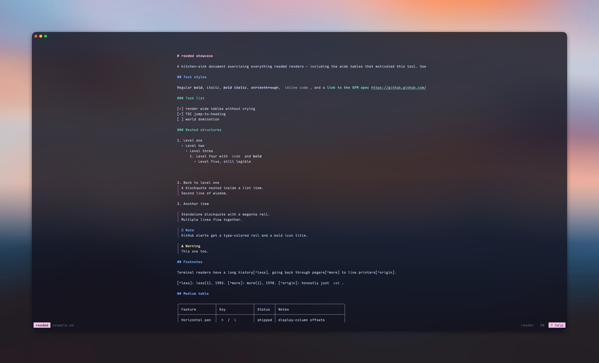

<h1 align="center">readmd</h1>

<p align="center">Read Markdown comfortably in your terminal, even when the tables are wide.</p>

<p align="center">
  <a href="https://github.com/lmilojevicc/readmd/actions/workflows/ci.yml"></a>
  <a href="https://github.com/lmilojevicc/readmd/graphs/contributors"></a>
  <a href="https://github.com/lmilojevicc/readmd/blob/main/LICENSE"></a>
</p>



readmd is a pager-style Markdown reader: prose wraps to your terminal, table
cells wrap for readability, and wide tables and code stay available by panning.
Find your place with an outline and search, follow links and footnotes with the
keyboard or mouse, and keep the colors of your terminal's own palette.

## Install

Supports **Linux and macOS**; Windows support is not promised.

Install with Homebrew (recommended):

```sh
brew install lmilojevicc/tap/readmd
```

Homebrew builds from source and installs its Go build dependency automatically.

Alternatively, with **Go 1.27+**:

```sh
go install github.com/lmilojevicc/readmd@latest
```

Make sure Go's binary directory (`$GOBIN`, or `$GOPATH/bin`, usually `~/go/bin`)
is on your `PATH`.

## Read

```sh
readmd                   # browse Markdown below the current directory
readmd README.md
cat notes.md | readmd
```

- `j` / `k` scroll; `h` / `l` pan wide content; `0` resets the pan.
- `o` opens the outline; `/` searches and `n` finds the next match.
- `p` selects links or footnotes by keyboard; click them with the mouse.
- `r` toggles the centered reader view; `m` releases mouse capture for selection.
- `Ctrl+f` browses files; `Esc` returns to the browser for files opened there.
- `?` shows help; `q` quits.

See [Usage](docs/usage.md) for controls and terminal support, or
[Configuration](docs/configuration.md) to set your startup preferences.

Custom colors, glyphs and callout presets use a separate partial
[theme file](docs/configuration.md#custom-themes); start from [theme.example.yaml](theme.example.yaml).
Default enhanced callout icons require a compatible Nerd Font or Octicons-capable
fallback. Set `callouts: {preset: unicode}` in your theme for portable icons
(without font-dependent per-type overrides).

## Contribute

Bug reports and focused improvements are welcome. Read
[Contributing](CONTRIBUTING.md) for setup and checks, and
[Security](SECURITY.md) for private vulnerability reporting.

## License

Copyright (C) 2026 Luka.

Licensed under the GNU General Public License, version 3 only
(**GPL-3.0-only**), not "version 3 or later". See [License](LICENSE) for the terms
and [Third-party notices](THIRD_PARTY_NOTICES.md) for dependency credits and
licenses. Dependency code retains its own licenses and notices.
